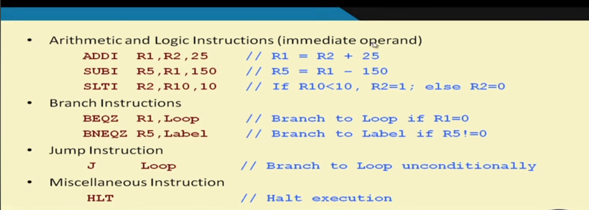
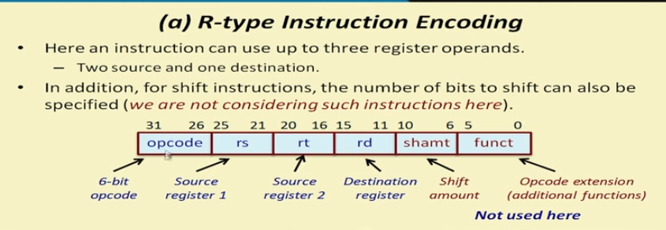
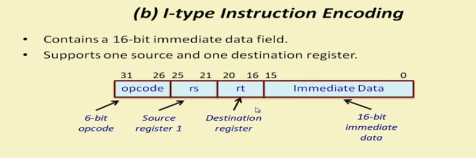
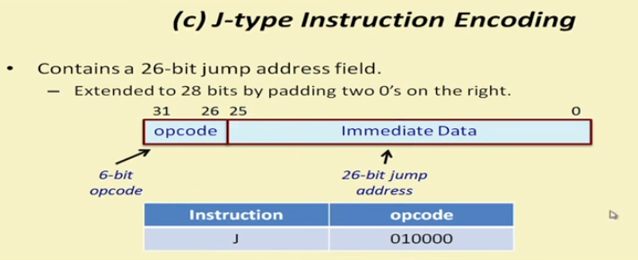
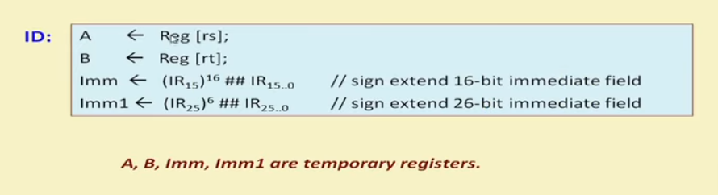
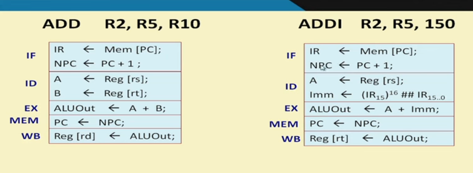

# Learning about MIPS
- Going to consider small subset of MIPS instruction not all of them so will do [[later]]

### Quick look at Mips32
- 32 gpr r0 - r31
- Has PC special purpose register also 32 bit - pints to the next instruction in memory to be fetched and executed.
- No flag register
- limited set of addressing mode and only set of instruction that can access memory are load and store.
- We assume memory word size is 32 bits (word addressable)

## Instruction subset being consider

- Load and store insturction
  ```
  LW R2,124(R8)
  SW R5,-10(R25)
  ```
- Arithmetic and logic instruction
  ```
  ADD R1,R2,R3
  ADD R1,R2,R0
  ADD R1,R2,R0      // r1=r2+0
  SUB R12,R10,R9
  AND R20,R1,R5
  OR R11,R5,R6
  OR R11,R5,R7
  MUL R5,R6,R7
  SLT R5,R11,R12
  ```
- Arithmetic and logic instruction (Immediate operand)


## Mips insturction encoding
- All mips32 insturction can be classified into three groups in terms of encoding
  - r-type, I-type and J-type
  - in an insturcion encoding the 32 bits of the instuction are divided into several field
  
---
### R-type 



- last two section we wont be using in this implementation
```
add 000000
sub 000001
and 000010
or  000011
slt 000100
mul 000101
hlt 111111
```
### I-type



```
lw  001000
sw  001001
addi 0010101
subi 001011
slti 001100
bneqz 001101
beqz 001110
```
### J-type



- We are not implementing this type


## MIPS instruction cycle
- IF : insturction fetch
- ID : Instruction decode/register fetch
- EX : execution/effective address calculation
- MEM : memory access/branch completion
- WB : Register write back
  Generic micro instructions carries out in the various steps.

### instruction fetch
- Here the insturction pointed to by PC is fetched from memory and also the next value of pc is computed.
- For branch insturction new value of the pc may be the target address. SO PC is not updated in this stage; new value is stored in a register NPC

```
IR <- MEM[PC];
NPC <- PC+1;
```
### Instruction Decode
- the instuction already fetched in ir is decoded
- decoding is done in paralled with reading the register operands rs and rt
  - 

### Execution (EX): 
The Arithmetic Logic Unit (ALU) performs necessary calculations, such as arithmetic operations or computing effective memory addresses for load/store instructions.

### Memory Access (MEM): (4:48) 
Data is read from or written to memory (for load/store instructions), or branch conditions are evaluated.

### Write Back (WB): (4:58) 
The final result is written back into the appropriate destination register in the register bank.

- 
